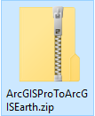
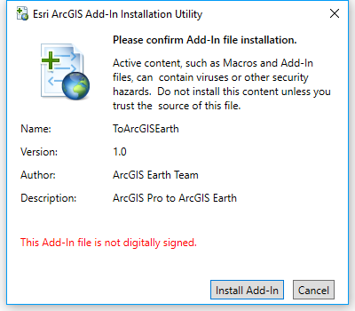
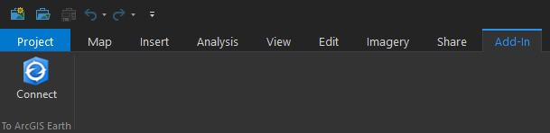

# ArcGIS Pro To ArcGIS Earth
Sync ArcGIS Pro's Camera To ArcGIS Earth

### Downloads
`\\dory\share\Projects\ArcGISEarth\INSTALL\Addins\ArcGISProToArcGISEarth.zip`

### Setup
- Download and Unzip the file

- Install the 'esri.addinX' file

### Use
- You can find the tool on the 'Add-In' tab in ArcGIS Pro

- Launch the ArcGIS Earth
- Click the connet button
- Enjoy the tool
